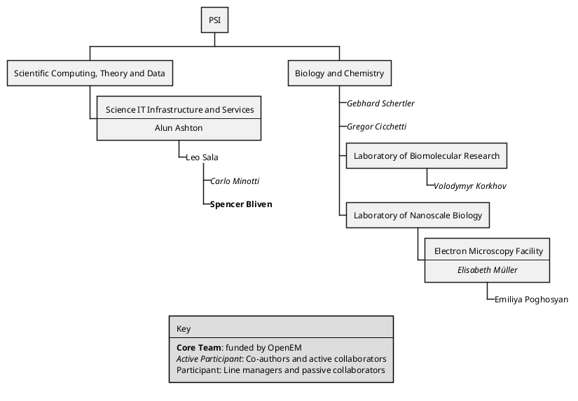
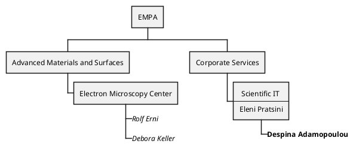
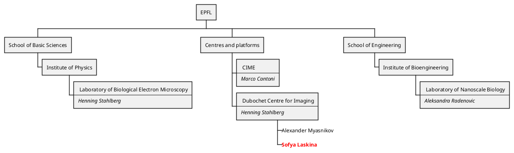
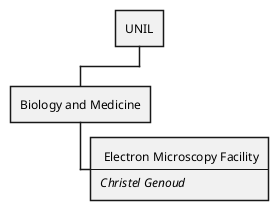
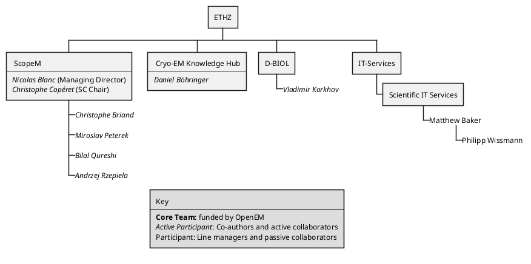
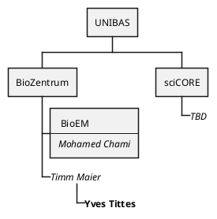
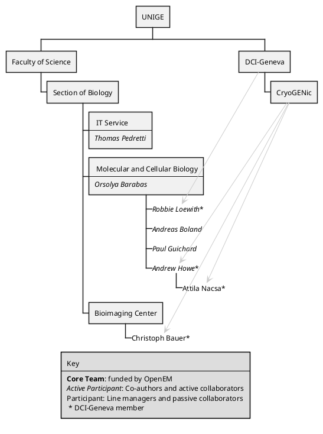
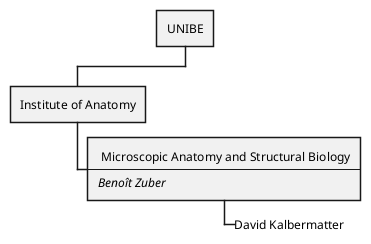

# Key 
**Core Team**: funded by OpenEM
*Active Participant*: Co-authors and active collaborators
Participant: Line managers and passive collaborators

# PSI

# EMPA

[Ref](https://www.empa.ch/documents/20659/66489/Organigramm+English/81354988-9bd6-4b3c-984c-7cd5785f298e)
- Is Debora still involved?
# EPFL

# UNIL

# ETHZ

- [X] Checked by Andrzej

# UNIBAS

# UNIGE

# UNIBE

