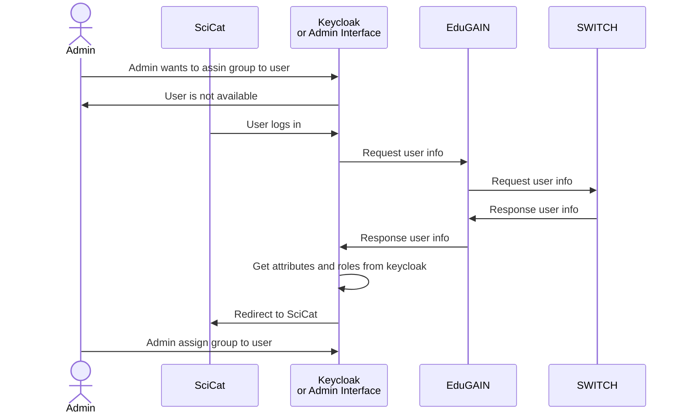

```mermaid
sequenceDiagram
actor AI as Admin
participant SC as SciCat
participant KC as Keycloak<br> or Admin Interface
participant EDU as EduGAIN
participant SWITCH as SWITCH

AI ->> KC: Admin wants to assin group to user
KC ->> AI: User is not available

SC ->> KC: User logs in
KC ->> EDU: Request user info
EDU ->> SWITCH: Request user info
SWITCH ->> EDU: Response user info
EDU ->> KC: Response user info
KC ->> KC: Get attributes and roles from keycloak
KC ->> SC: Redirect to SciCat

AI ->> KC: Admin assign group to user
```