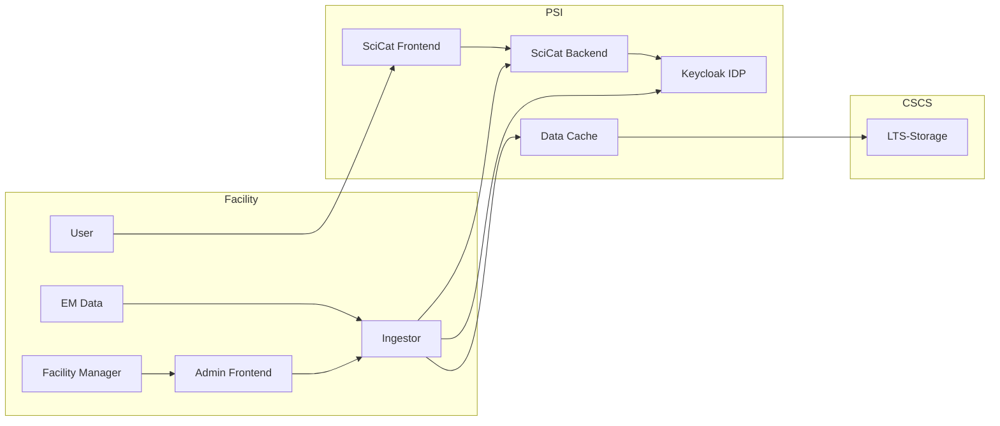

# Admin Pages - Overview

### Participants
* Facilitiy
    * User
    * Facilitsy Manager
    * EM Data Server
    * Ingestor
    * Admin-Interface 

* PSI
    * SciCat Backend
    * SciCat Frontend
    * Data Cache
    * Keycloak IDP

* CSCS
    * LTS-Storage

### Groups for Access
* SciCat
    * Owner Group (Admin. Dataset)
    * Access Group 
    * Auth Roles
    * ...

* Ingestor
    * Admin
    * Read
    * Write

### Overview - Participants
