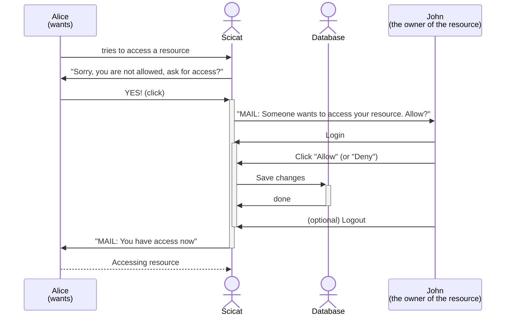

```mermaid
sequenceDiagram
participant A as Alice<br>(wants)
actor S as Scicat
actor DB as Database
participant B as John<br>(the owner of the resource)
A->>S: tries to access a resource
S->>A: "Sorry, you are not allowed, ask for access?"
A->>+S: YES! (click)
S->>B: "MAIL: Someone wants to access your resource. Allow?"
B->>+S: Login
B->>S: Click "Allow" (or "Deny")
S->>+DB: Save changes
DB->>-S: done
B->>S: (optional) Logout
deactivate S
S->>-A: "MAIL: You have access now"
A-->>S: Accessing resource
```