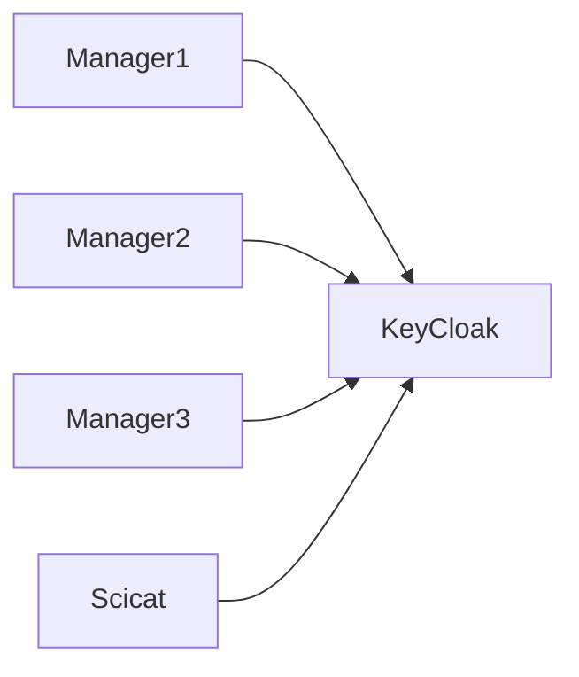
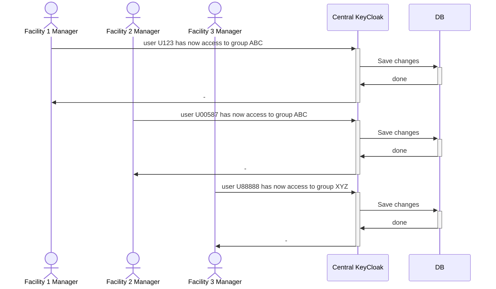

```mermaid
    flowchart LR
    Manager1 --> KeyCloak
    Manager2 --> KeyCloak
    Manager3 --> KeyCloak
    Scicat --> KeyCloak
```
----

```mermaid
    sequenceDiagram
    actor Admin1 as Facility 1 Manager
    actor Admin2 as Facility 2 Manager
    actor Admin3 as Facility 3 Manager
    participant KeyCloak as Central KeyCloak
    participant DB
    Admin1->>+KeyCloak: user U123 has now access to group ABC
    KeyCloak->>+DB: Save changes
    DB->>-KeyCloak: done
    KeyCloak->>-Admin1: -
    Admin2->>+KeyCloak: user U00587 has now access to group ABC
    KeyCloak->>+DB: Save changes
    DB->>-KeyCloak: done
    KeyCloak->>-Admin2: -
    Admin3->>+KeyCloak: user U88888 has now access to group XYZ
    KeyCloak->>+DB: Save changes
    DB->>-KeyCloak: done
    KeyCloak->>-Admin3: -
```
