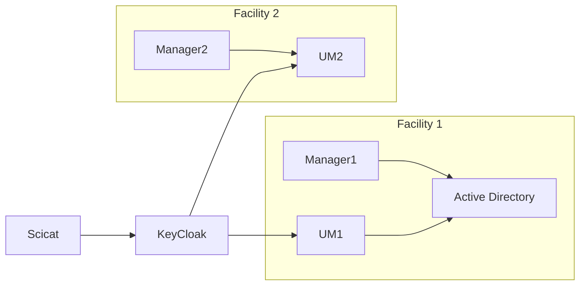
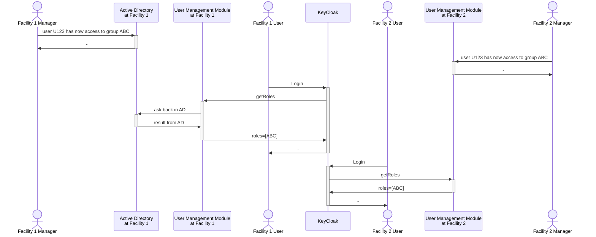

```mermaid
    flowchart LR
    subgraph Facility 1
        Manager1 --> AD1[Active Directory]
        UM1 --> AD1
    end
    subgraph Facility 2
        Manager2 --> UM2
    end
    KeyCloak --> UM1
    KeyCloak --> UM2
    Scicat --> KeyCloak
```
----

```mermaid
    sequenceDiagram
    actor Admin1 as Facility 1 Manager
    participant AD1 as Active Directory<br>at Facility 1
    participant UM1 as User Management Module<br>at Facility 1
    actor User1 as Facility 1 User
    participant KeyCloak
    actor User2 as Facility 2 User
    participant UM2 as User Management Module<br>at Facility 2
    actor Admin2 as Facility 2 Manager

    Admin1->>+AD1: user U123 has now access to group ABC
    AD1->>-Admin1: -
    Admin2->>+UM2: user U123 has now access to group ABC
    UM2->>-Admin2: -

    User1->>+KeyCloak: Login
    KeyCloak->>+UM1: getRoles
    UM1->>+AD1: ask back in AD
    AD1->>-UM1: result from AD
    UM1->>-KeyCloak: roles=[ABC]
    KeyCloak->>-User1: -

    User2->>+KeyCloak: Login
    KeyCloak->>+UM2: getRoles
    UM2->>-KeyCloak: roles=[ABC]
    KeyCloak->>-User2: -
```
    