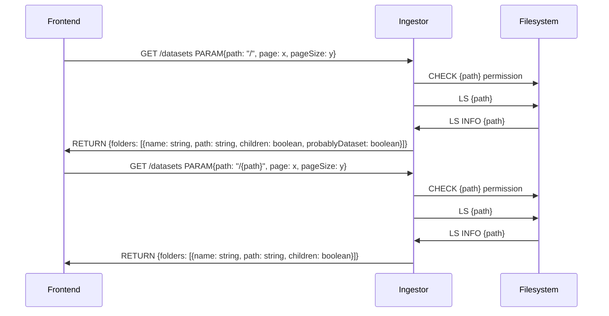
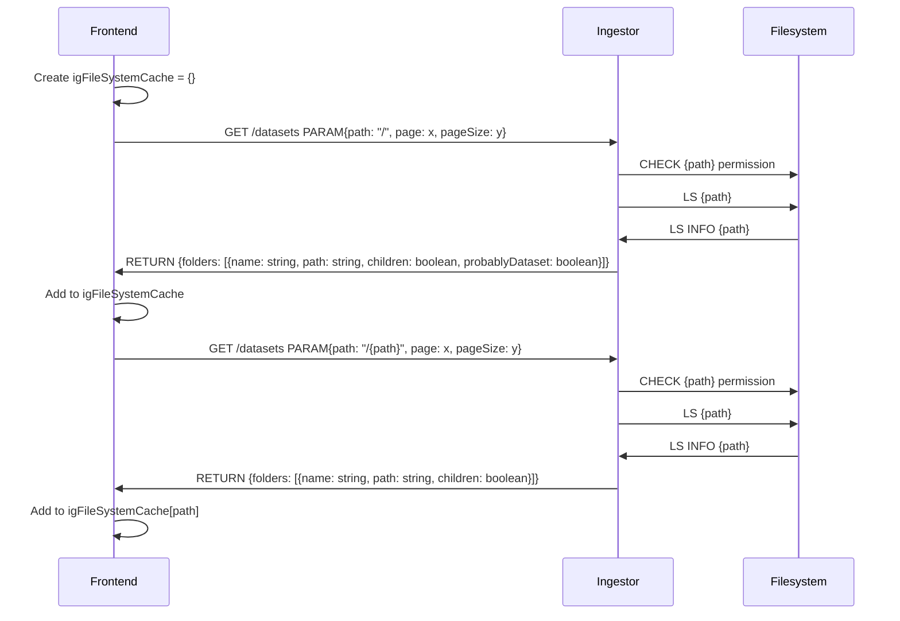

# File Browser Interface
## Variants
a) UI holds a recursive list of folders and caches new requests 

b) UI asks everytime if the user changes the path

## TS Interface

```
interface FilesystemFolder {
    name: string;
    path: string;
    children: boolean;
    child?: FilesystemFolder;
    probablyDataset?: boolean;
}
```

## Workflow

### Variant a)


### Variant b)
In this case we need some kind of refresh button or a timeout to refresh the cache.

