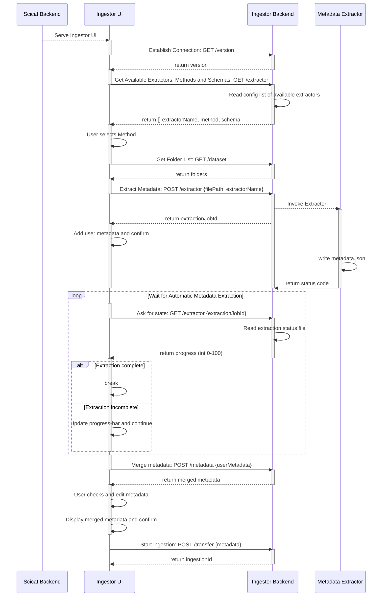

# Ingestion Sequence

* Participants
* Expected sequence
* Endpoints
* Data

```mermaid
sequenceDiagram
  participant S as Scicat Backend
  participant U as Ingestor UI 
  participant B as Ingestor Backend 
  participant M as Metadata Extractor
    S -->> U: Serve Ingestor UI
    activate U
    U ->> B: Establish Connection: GET /version
    deactivate U
    activate B
    B -->> U: return version
    deactivate B
    activate U
    U ->> B: Get Available Extractors, Methods and Schemas: GET /extractor
    deactivate U
    activate B
    B ->> B: Read config list of available extractors
    B -->> U: return [] extractorName, method, schema
    deactivate B
    activate U
    U ->> U: User selects Method
    U ->> B: Get Folder List: GET /dataset
    deactivate U
    activate B
    B -->> U: return folders
    deactivate B

    activate U
    U ->> B: Extract Metadata: POST /extractor {filePath, extractorName}
    deactivate U
    activate B
    B -->> M: Invoke Extractor
    activate M
    B -->> U: return extractionJobId
    activate U
    U ->> U: Add user metadata and confirm
    M ->> M: write metadata.json
    M -->> B: return status code
    deactivate M
    deactivate B
    deactivate U

    loop Wait for Automatic Metadata Extraction
        activate U
        U ->> B: Ask for state: GET /extractor {extractionJobId}
        deactivate U
        activate B
        B ->> B: Read extraction status file
        B -->> U: return progress (int 0-100)
        deactivate B
        activate U
        
        alt Extraction complete
            U ->> U: break
        else Extraction incomplete
            U ->> U: Update progress-bar and continue
        end
        deactivate U
    end

    activate U
    U ->> B: Merge metadata: POST /metadata {userMetadata}
    deactivate U
    activate B
    B -->> U: return merged metadata
    deactivate B
    activate U
    U ->> U: User checks and edit metadata
    U ->> U: Display merged metadata and confirm
    deactivate U
    U ->> B: Start ingestion: POST /transfer {metadata}
    activate B
    B -->> U: return ingestionId
    deactivate B
    
```