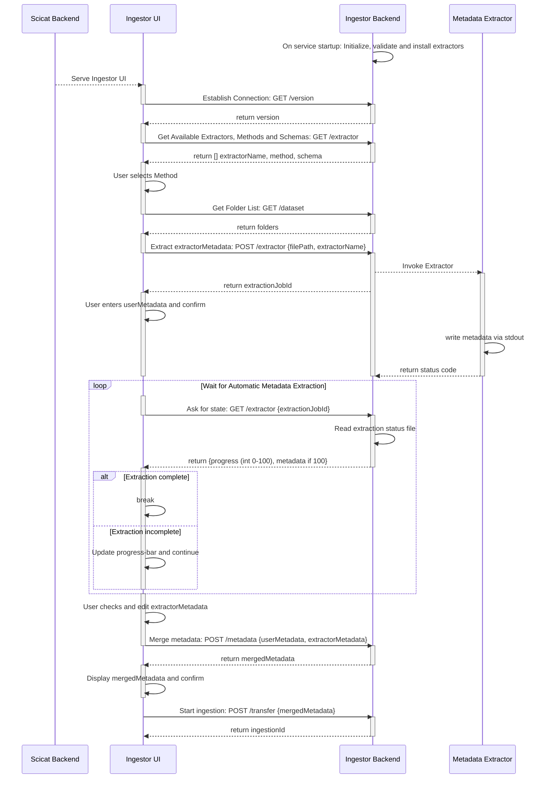

# Ingestion Sequence

### Participants
* Scicat Backend (Service)
* Ingestor UI (Web-Frontend)
* Ingestor Backend (Service)
* Metadata Extractor (Executable)

### Endpoints ###
* See API-speficiation

### Data
* Extractor-Information: (Defines Method, Extractor, Schema per Extractor)
* userMetadata: Metadata which is entered manually by the user
* extractorMetadata: Metadata which is automatically extracted by the Metadata Extractor
* mergedMetadata: Combined Metadata of userMetadata and extractorMetadata
* Dataset: filePath of the Dataset

### Ingestion-Flow

