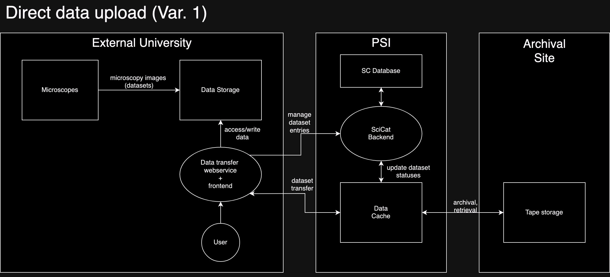
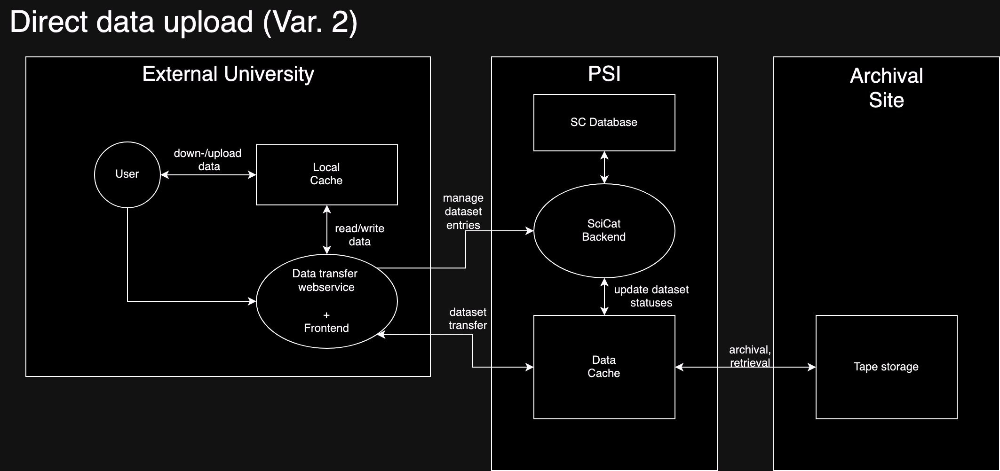
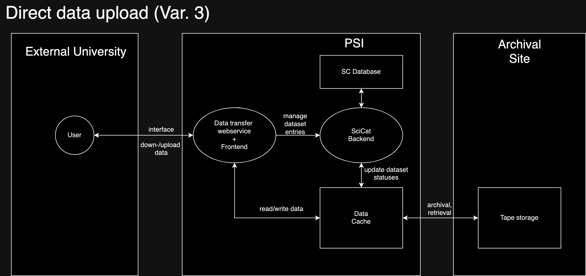
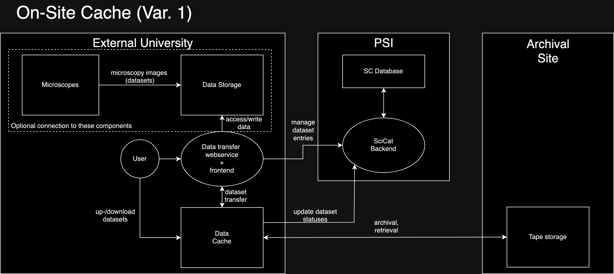
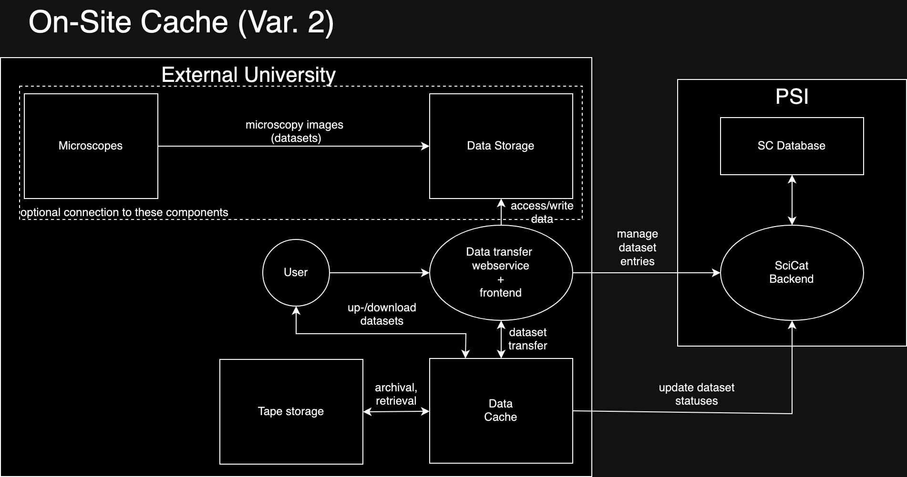

# Data Transfer Architecture Planning
## Direct Data Upload (Variation 1) - Direct access to central storage

A fast option for delivering data to PSI with data transfers being queued up and minimised data transfers on the local site.

Ingestion steps:
1. The user selects the dataset(s) they want to ingest
2. The user fills out the necessary information about each dataset (owner, principal investigator, access groups etc.)
3. The user then can start the ingestion process
4. The data transfer web service (backend) will fetch the data from a data storage server where the datasets are collected
5. It will extract the necessary metadata. Then, with the information from the user, dataset entries are created on the PSI SciCat instance using REST API calls.
6. Afterwards, using some data transfer protocol (rsync, Globus, S3...), the dataset(s) are transfered over to the PSI cache server 
7. At some point, when certain conditions are met (some time has elapsed, user requests archival), the data gets transfered to the archival site where it'll get archived on tape storage.

Advantages:
 - It requires the least amount of new servers/vm's
 - Least amount of responsibility on institution side
 - Generally simple
 - Uses the most amount of pre-existing resources
 - Minimises the need for moving data around locally thus speeding up the overall process

Disadvantages:
 - Puts most of the responsiblity on PSI (single point of failure?)
 - Additional file transfer between local site and PSI before data can be archived/retrieved
 - Slowest method when archiving or retrieving datasets
 - Two phases of over-the-internet communication (less safe, slower)

## Direct Data Upload (Variation 2) - Direct user upload to local cache

This variation removes the usage of the microscope’s storage server and expects the user to posses the data on their own workstation.

Ingestion steps:
1. The user selects the dataset(s) they want to ingest
2. The user fills out the necessary information about each dataset (owner, principal investigator, access groups etc.)
3. The user then uploads the datasets to a cache location
4. The data transfer web service (backend) will start the ingestion from this cache location 
5. It will extract the necessary metadata. Then, with the information from the user, dataset entries are created on the PSI SciCat instance using REST API calls.
6. Afterwards, using some data transfer protocol (rsync, Globus, S3...), the dataset(s) are transfered over to the PSI cache server 
7. At some point, when certain conditions are met (some time has elapsed, user requests archival), the data gets transfered to the archival site where it'll get archived on tape storage

Advantages:
 - Still relatively simple
 - Doesn't require too much infrastructure investment
 - Protects the main data collection point better (no direct access to it from the webservice)

Disadvantages:
 - Still puts a lot of responsibility on PSI
 - Might require long data upload/download sessions from users using their own workstations
 - Additional data movements makes archival slower:
   - microscope storage -> workstation
   - workstation -> cache server
 - Two phases of over-the-internet communication (less safe, slower)

## Direct Data Upload (Variation 3) - Direct user upload to remote cache

This variation minimises maintenance tasks for and responsiblities put on participating universities by adding all necessary changes for data transfer to PSI. This would involve a potential web service being created that would be able to receive a dataset from an external user and do the ingestion job by itself.

Ingestion steps:
1. The user selects the dataset(s) they want to ingest
2. The user fills out the necessary information about each dataset (owner, principal investigator, access groups etc.)
3. The user then uploads the datasets to PSI's cache through the webservice 
4. The webservice will extract the necessary metadata. Then, with the information from the user, dataset entries are created on the PSI SciCat instance using REST API calls.
5. At some point, when certain conditions are met (some time has elapsed, user requests archival), the data gets transfered to the archival site where it'll get archived on tape storage

Advantages:
 - Simple for facilities
 - Doesn't require any infrastructure investment from external universities
 - Protects the main data collection point better (no direct access to it from the webservice)
 - Minimises responsiblity for universities

Disadvantages:
 - All the responsibility goes to PSI
 - Requires long data up-/download sessions to PSI (should be able to continue at a later date though)
 - Additional data movements makes archival slower:
   - microscope storage -> workstation
   - workstation -> remote cache location
 - Limits data transfers to working hours, creating a very uneven distribution of network usage periods
 - Can cause headaches to users if the UX is not handled properly (accidentally never finishing the transfer, for example)

## On-Site Cache (Variation 1) - Hybrid Solution

Here, the data cache is maintained as part of the local university system, while the tape storage is still a remote location. 

Ingestion steps:
1. User selects dataset(s) for ingestion
2. User fills out necessary information about each dataset
3. User starts ingestion process
4. The data transfer web service (backend) will extract (meta)data from the data storage
5. This metadata along with the user inputted values is used to create the SciCat entries via REST API calls by the backend
6. Either the backend will copy the data over to the local cache server, or a separate process. 
7. The cache will archive/retrieve datasets depending on need at the remote site, and keeps the SciCat entries updated about the status of packages

Advantages:
 - One less step in the archival/retrieval process
 - Reduces bandwidth requirements on the PSI side considerably (compared to Direct Data Transfer)
 - It only requires one extra cache server in the local infrastructure
 - Shared responsibility of data 

Disadvantages:
 - More investment/expenses required than the direct data upload approach
 - External transfer of data makes this model less secure (than the following one)
 - Requires interaction with two sites from the institution side (PSI, archival site)

## On-Site Cache (Variation 2) - Fully Independent Archival

The institution implements its own archival solution entirely and only the SciCat instance of PSI is used.

Ingestion steps:
1. User selects dataset(s) for ingestion
2. User fills out necessary information about each dataset
3. User starts ingestion process
4. The data transfer web service (backend) will extract (meta)data from the data storage
5. This metadata along with the user inputted values is used to create the SciCat entries via REST API calls by the backend
6. Either the backend will copy the data over to the local cache server, or a separate process. 
7. The cache will either directly handle archival to/retrieval from tape or there's a separate unit that does this. It'll keep the SciCat instance up to date on the state of datasets. 

Advantages:
 - No external communication of data
 - Reduces bandwidth requirements on the PSI side considerably (compared to Direct Data Transfer)
 - Safest & Fastest method overall (no external transfer)
 - No need for using any external service aside from SciCat
 
 Disadvantages:
 - Largest investment in local infrastructure
 - All responsibility is on the institution
 - Most complex solution for universities
 - Ignores most pre-existing resources (PSI cache server, archival site)