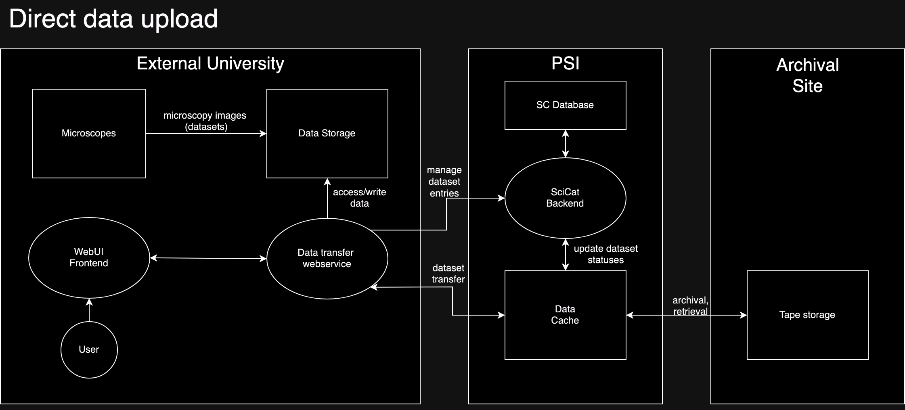
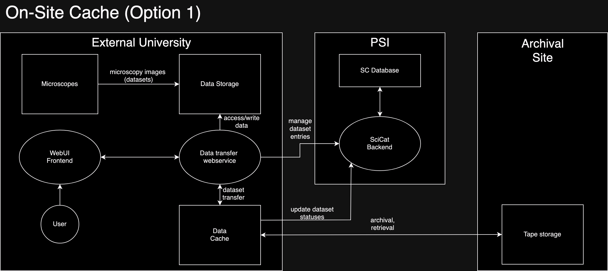
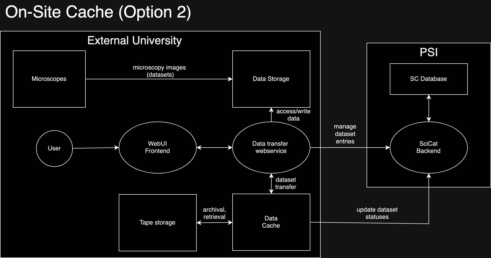

# Data Transfer Architecture Planning
## Direct Data Upload

This option is the one proposed by default to all universities which do not plan on having their own archival storage system. 

Ingestion steps:
1. The user selects the dataset(s) they want to ingest
2. The user fills out the necessary information about each dataset (owner, principal investigator, access groups etc.)
3. The user then can start the ingestion process
4. The data transfer web service (backend) will fetch the data from a data storage server where the datasets are collected
5. It will extract the necessary metadata. Then, with the information from the user, dataset entries are created on the PSI SciCat instance using REST API calls.
6. Afterwards, using some data transfer protocol (rsync, Globus, S3...), the dataset(s) are transfered over to the PSI cache server 
7. At some point, when certain conditions are met (some time has elapsed, user requests archival), the data gets transfered to the archival site where it'll get archived on tape storage.

Advantages:
 - It requires the least amount of new servers/vm's
 - Least amount of responsibility on institution side
 - Generally simple
 - Uses the most amount of pre-existing resources

Disadvantages:
 - Puts most of the responsiblity on PSI (single point of failure?)
 - Additional file transfer between local site and PSI before data can be archived/retrieved
 - Slowest method when archiving or retrieving datasets
 - Two phases of external communication of data makes this model the least secure in theory. The impact is not overly significant however

## On-Site Cache (Option 1) - Hybrid Solution

Here, the data cache is maintained as part of the local university system, while the tape storage is still a remote location. 

Ingestion steps:
1. User selects dataset(s) for ingestion
2. User fills out necessary information about each dataset
3. User starts ingestion process
4. The data transfer web service (backend) will extract (meta)data from the data storage
5. This metadata along with the user inputted values is used to create the SciCat entries via REST API calls by the backend
6. Either the backend will copy the data over to the local cache server, or a separate process. 
7. The cache will archive/retrieve datasets depending on need at the remote site, and keeps the SciCat entries updated about the status of packages

Advantages:
 - One less step in the archival/retrieval process
 - Reduces bandwidth requirements on the PSI side considerably (compared to Direct Data Transfer)
 - It only requires one extra cache server in the local infrastructure
 - Shared responsibility of data 

Disadvantages:
 - More investment/expenses required than the direct data upload approach
 - External transfer of data makes this model less secure
 - Requires interaction with two sites from the institution side ()

## On-Site Cache (Option 2) - Fully Independent Archival

The institution implements its own archival solution entirely and only the SciCat instance of PSI is used.

Ingestion steps:
1. User selects dataset(s) for ingestion
2. User fills out necessary information about each dataset
3. User starts ingestion process
4. The data transfer web service (backend) will extract (meta)data from the data storage
5. This metadata along with the user inputted values is used to create the SciCat entries via REST API calls by the backend
6. Either the backend will copy the data over to the local cache server, or a separate process. 
7. The cache will either directly handle archival to/retrieval from tape or there's a separate unit that does this. It'll keep the SciCat instance up to date on the state of datasets. 

Advantages:
 - No external communication of data
 - Reduces bandwidth requirements on the PSI side considerably (compared to Direct Data Transfer)
 - Safest & Fastest method overall (no external transfer)
 - No need for using any external service aside from SciCat
 
 Disadvantages:
 - Largest investment in local infrastructure
 - All responsibility is on the institution
 - Most complex solution for universities
 - Ignores most pre-existing resources (PSI cache server, archival site)